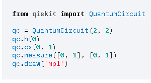
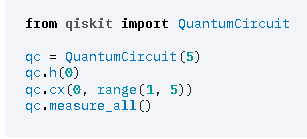
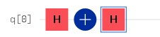
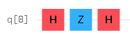

<!--
class: title
_backgroundColor: orange
-->

# 想定問題集

---
<!--
class: slides
-->

## 問題１

### 位相回転するゲートは？

1. Xゲート
2. Yゲート
3. Zゲート
4. Tゲート
5. Sゲート

---

## 回答1

### Z軸の周りを回転することを位相回転（Phase flip）という

3. Zゲート
4. Tゲート
5. ゲート

---

## 問題２

### ビット反転するゲートは？

1. Xゲート
2. Zゲート
3. Tゲート
4. Sゲート

---
## 回答2

### パウリX行列をつかうと|0>が|1>に|1>が|0>になる。これをビット反転（bit flip）という

1. Xゲート

---
## 問題３

### 下記を実行すると、量子状態はどうなりますか1？

---

## 問題４

### 下記を実行すると、量子状態はどうなりますか2？

---

## 問題５

### 下記と等価なゲートは1？

---

## 問題６

### 下記と等価なゲートは2？

---

## 問題７

### Sゲートのフェーズの値は？

- π/2
- π/4
- π/8
- π

---

## 問題８

### Tゲートのフェーズの値は？

- π/2
- π/4
- π/8
- π

---

## 問題９

### QuantumCircuit　正しくない記述は？

- QuantumCircuit(QuantumRegister(4))
- QuantumCircuit(QuantumRegister(4), ClassicalRegister(3))
- QuantumCircuit(QuantumRegister(4, 'qr0'), QuantumRegister(2, 'qr1'))
- QuantumCircuit（4,4)
- QuantumCircuit（cr,qr)
- qr = QuantumRegister(2)
  cr = ClassicalRegister(2)
  qc = QuantumCircuit(cr[0:2],qr[0:2])

---

## 問題10

### Measure　正しくない記述は？

- circuit = QuantumCircuit(2, 2)
  circuit.measure([0,1], [0,1])
- circuit = QuantumCircuit(2, 2)
  circuit.measure(0, 0)
  circuit.measure(1, 1)
- qreg = QuantumRegister(2, "qreg")
  creg = ClassicalRegister(2, "creg")
  circuit = QuantumCircuit(qreg, creg)
  circuit.measure(qreg, creg)
- circuit = QuantumCircuit(qreg, creg)
  circuit.measure(qreg[0], creg[0])

---
問題10 Measure　正しくない記述は？
